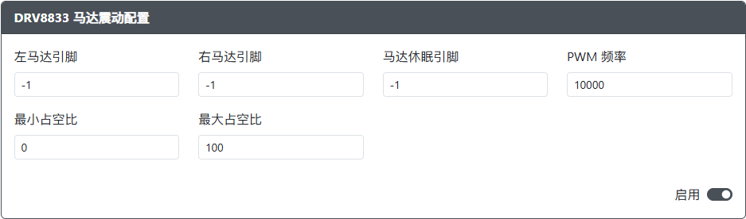

# DRV8833 马达震动配置

用途：此插件允许您在 Xinput 模式下使用 DRV8833 震动功能。

## 网页配置器选项

- `左马达引脚` - DRV8833 上左侧电机 `AIN1` 连接的 GPIO 引脚。
- `右马达引脚` - DRV8833 上右侧电机 `AIN2` 连接的 GPIO 引脚。
- `马达休眠引脚` - DRV8833 上 `SLP` 连接的 GPIO 引脚。
- `PWM 频率` - 电机的 PWM 频率（建议从 10,000 开始，并根据需要调整）。
- `最小占空比` - 0-255 震动值的最低范围百分比。
- `最大占空比` - 0-255 震动值的最高范围百分比。

### 要求

此插件需要一个 DRV8833 电机驱动器或扩展板，以及一个或两个震动电机。
