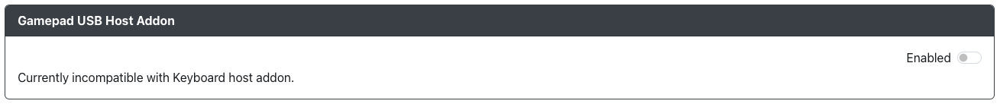

# 游戏控制器 USB 主机

用途：此插件旨在允许游戏控制器与 GP2040-CE 一起使用。例如，可以将受支持的 USB 游戏控制器插入可用的 USB 主机端口，然后使用该 USB 游戏控制器进行游戏。此功能可以将受支持的游戏控制器转换为适用于其原本不支持的系统。

## 网页配置器选项

目前，您只能启用或禁用此插件。

请注意，目前您必须在 `键盘主机` 和 `游戏控制器 USB 主机` 之间进行选择。

## 硬件

要使用此插件，您需要以下之一的游戏控制器：
- Sony Dualshock 4 无线控制器
- Google Stadia 控制器
- Ultrastick 360（2015 年之前版本）
- Ultrastick 360

### 要求

:::note

请注意，未来可能会增加更多游戏控制器的支持。目前我们不接受添加额外游戏控制器的请求。

:::
