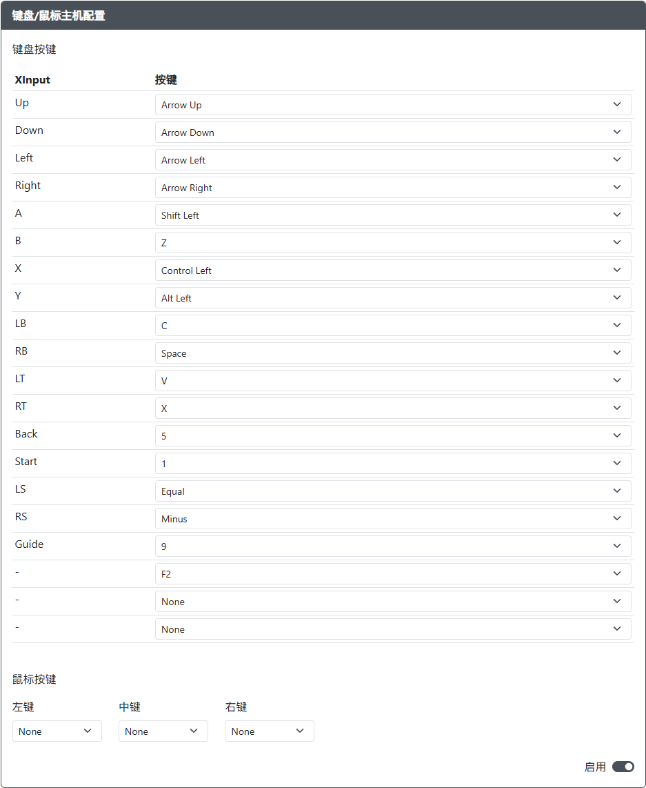

import InputLabelSelector, {
  Hotkey,
} from "@site/src/components/LabelSelector.tsx";
import InstallUSBHostPort from "../snippets/_add-usb-host-port.mdx";

选择要在使用指南中显示的按键标签：

<InputLabelSelector />
 

用途：此插件旨在允许用户将键盘与 GP2040-CE 配合使用，并与 GP2040-CE 支持的系统兼容。

:::info 此页面并非键盘输入模式设置

此插件的用法是将键盘插入游戏控制器的 USB 接口上，通过按下键盘上的按键，由 GP2040-CE 将键盘信号转换为其它支持的输入模式信号。

如果您想让游戏控制器输出键盘信号，请前往 [`系统设置 > 输入模式设置`](../web-configurator/menu-pages/01-settings.mdx#键盘映射)。

:::

## 网页配置器选项

:::info GPIO 引脚分配

USB 主机端口的 Data、5V Enable 和 Pin Orientation 选项现在在 [`功能配置 > 外围设备映射 - USB 主机`](../web-configurator/menu-pages/03-peripheral-mapping.mdx#usb-主机) 中配置。

:::

### 默认按键绑定

| GP2040                           | 键盘按键     |
| -------------------------------- | ------------ |
| <Hotkey buttons={["Up"]}/>       | 上箭头       |
| <Hotkey buttons={["Down"]}/>     | 下箭头       |
| <Hotkey buttons={["Left"]}/>     | 左箭头       |
| <Hotkey buttons={["Right"]}/>    | 右箭头       |
| <Hotkey buttons={["B1"]}/>       | 左 Shift     |
| <Hotkey buttons={["B2"]}/>       | Z            |
| <Hotkey buttons={["B3"]}/>       | 左 Control   |
| <Hotkey buttons={["B4"]}/>       | 左 Alt       |
| <Hotkey buttons={["L1"]}/>       | C            |
| <Hotkey buttons={["R1"]}/>       | 空格         |
| <Hotkey buttons={["L2"]}/>       | V            |
| <Hotkey buttons={["R2"]}/>       | X            |
| <Hotkey buttons={["S1"]}/>       | 5            |
| <Hotkey buttons={["S2"]}/>       | 1            |
| <Hotkey buttons={["L3"]}/>       | 等号         |
| <Hotkey buttons={["R3"]}/>       | 减号         |
| <Hotkey buttons={["A1"]}/>       | 9            |
| <Hotkey buttons={["A2"]}/>       | F2           |
| <Hotkey buttons={["Function"]}/> | 无           |

## 硬件

### 要求

此插件需要设备上有一个 USB 主机端口，并且该端口连接到 RP2040 板上的 GPIO 引脚。实现此功能有多种方法。

请参阅 [USB 主机端口安装](../controller-build/usb-host.mdx) 了解有关将 USB 主机端口添加到游戏控制器的详细要求。

### 安装

<InstallUSBHostPort />

## 其他说明

只要键盘带有 USB 插头，任何键盘都可以与此插件配合使用，包括无线 USB 键盘。

由于当前 Pico-PIO-USB 和插件系统的实现方式，存在以下限制：

- 键盘仅限于上述列出的输入数量。键盘上的其他按键将无法使用，并且不会向系统发送任何输入信号。
- 键盘受限于 6 键无冲（6 key rollover），这意味着最多只能同时激活 6 个键盘按键。即使所使用的键盘通常支持全键无冲（NKRO），此限制仍然适用。
- 键盘无法在启动时影响输入模式。输入模式必须通过 `网页配置器 > 系统设置` 或 GP2040-CE 设备上的额外开关进行设置。
