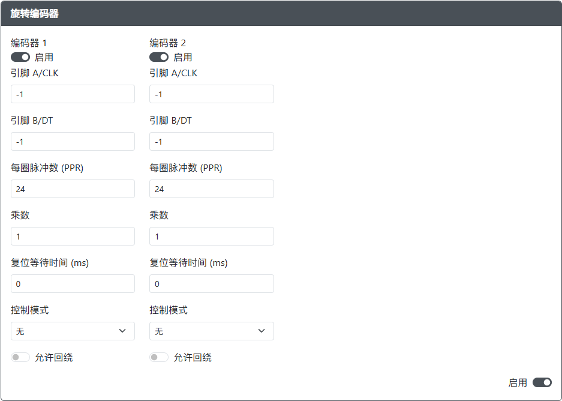

# 旋转编码器

:::warning Beta

请注意，旋转编码器功能目前处于测试阶段。

:::

用途：旋转编码器允许在指定引脚上实现连续或有限的最小-最大脉冲。

## 网页配置器选项

- `启用` - 启用或禁用 `编码器 1` 或 `编码器 2`。  
- `引脚 A/CLK` - 编码器的 `Clock` 引脚。  
- `引脚 B/DT` - 编码器的 `Data` 引脚。  
- `每圈脉冲数 (PPR)` - 编码器每转的脉冲数。  
- `乘数` - 使用此乘数微调旋转编码器在 GP2040-CE 中的性能。  
- `复位等待时间 (ms)` - 等待的毫秒数，在此时间后将值重置为 `0` 或 `center`。  
- `控制模式` - 选择此编码器的工作模式。  
- `允许回绕` - 允许编码器在达到轴的最大值时回绕到轴的最小值。  

## 硬件

目前我们没有推荐的模块。这是一个新引入的功能。  
