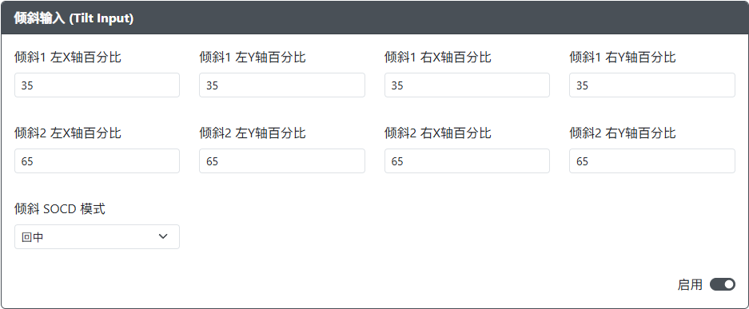

# 倾斜输入 (Tilt Input)

用途：倾斜输入插件允许用户通过左侧和右侧模拟摇杆发送一定百分比的最大方向输入（例如，在右侧模拟摇杆上发送 65% 的向下-右输入）。

## 网页配置器选项

- `倾斜 1 左 X 轴百分比` - 当 `Tilt 1 Pin` 激活时，左侧模拟摇杆 X 轴输入的百分比。（最小值 0，最大值 100）
- `倾斜 1 左 Y 轴百分比` - 当 `Tilt 1 Pin` 激活时，左侧模拟摇杆 Y 轴输入的百分比。（最小值 0，最大值 100）
- `倾斜 1 右 X 轴百分比` - 当 `Tilt 1 Pin` 激活时，右侧模拟摇杆 X 轴输入的百分比。（最小值 0，最大值 100）
- `倾斜 1 右 Y 轴百分比` - 当 `Tilt 1 Pin` 激活时，右侧模拟摇杆 Y 轴输入的百分比。（最小值 0，最大值 100）
- `倾斜 2 左 X 轴百分比` - 当 `Tilt 2 Pin` 激活时，左侧模拟摇杆 X 轴输入的百分比。（最小值 0，最大值 100）
- `倾斜 2 左 Y 轴百分比` - 当 `Tilt 2 Pin` 激活时，左侧模拟摇杆 Y 轴输入的百分比。（最小值 0，最大值 100）
- `倾斜 2 右 X 轴百分比` - 当 `Tilt 2 Pin` 激活时，右侧模拟摇杆 X 轴输入的百分比。（最小值 0，最大值 100）
- `倾斜 2 右 Y 轴百分比` - 当 `Tilt 2 Pin` 激活时，右侧模拟摇杆 Y 轴输入的百分比。（最小值 0，最大值 100）
- `倾斜 SOCD 模式` - 选择默认 SOCD 覆盖模式（回中、后输入优先、先输入优先）。

请注意，倾斜输入的引脚需在主 [GPIO 引脚映射](../web-configurator/menu-pages/02-gpio-pin-mapping.mdx) 页面中进行设置。

## 硬件

### 要求

此插件需要额外的按钮或开关，因为它完全禁止将主方向键 (DPad) 设置为左侧或右侧模拟摇杆。

### 安装

对于每个按钮，将按钮的一侧连接到网页配置器中分配的对应 GPIO 引脚。将按钮的另一侧连接到 GND。

## 其他备注

- 由于此插件禁止将方向键 (DPad) 设置为左侧或右侧模拟摇杆，使用快捷键 `DPad Left Analog` 和 `DPad Right Analog` 会禁用方向键，而使用 `DPad Digital` 会重新启用方向键。
- 并非所有倾斜输入的模拟引脚都需要设置，但未设置的引脚将无法使用该输入，除非通过网页配置器重新映射输入。
- 此外，同时按下 Tilt 1 和 Tilt 2 并输入右侧模拟摇杆方向时，右侧模拟摇杆将作为方向键方向功能使用。
- 同时按下 Tilt 1 和 Tilt 2 并输入左侧模拟摇杆时，将优先 Tilt 1 并忽略 Tilt 2。
