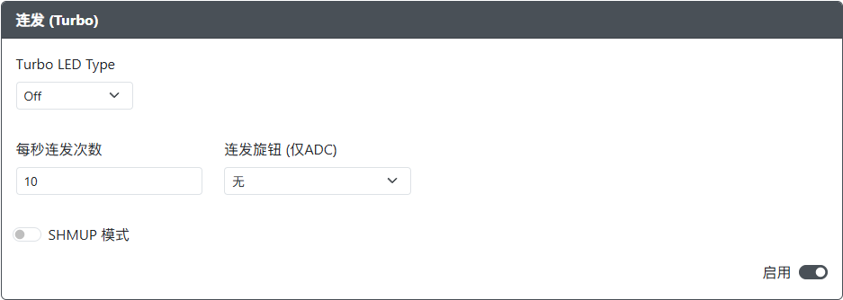
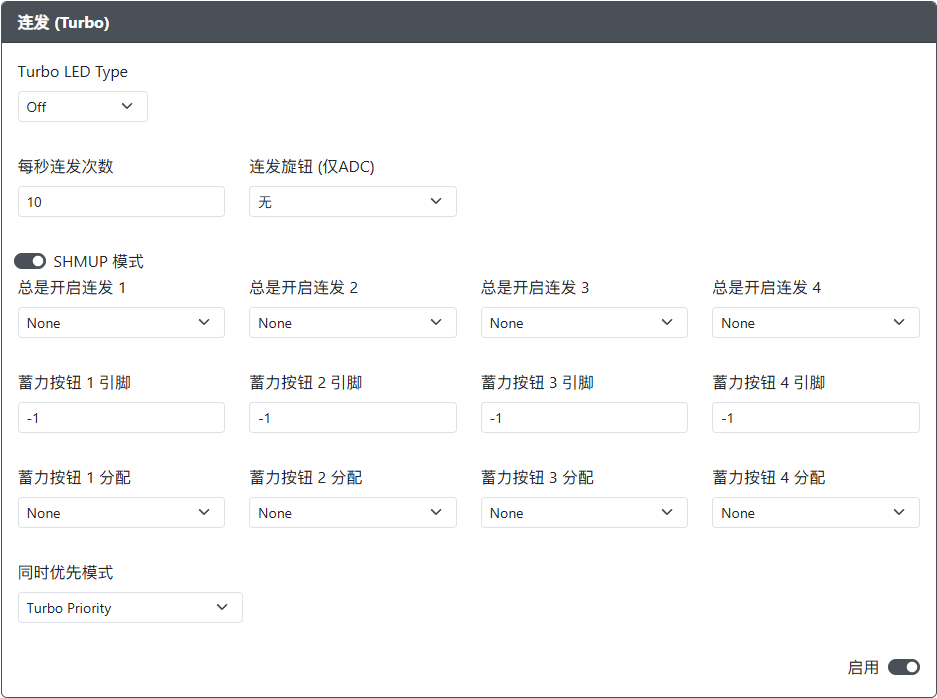
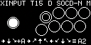

import InputTable from "../snippets/_input-table.mdx";

# 连发 (Turbo)

用途：此插件用于更改控制行为，使得按住一个按钮时能够快速触发一系列单独的按钮按下操作。

通过同时按下某个按键和连发按键，可以启用/禁用该按键的连发模式。开启之后只需单独按下该按键，对应的输入就会以连续的方式重复发送（根据网页配置器中的 `每秒连发次数` 设置）。

:::note

连发模式仅限于游戏控制器上的非方向性输入。

:::

## 网页配置器选项

### 通用选项

- `Turbo Pin` - 用于连发按钮的 GPIO 引脚，用于切换按钮的连发模式。
- `Turbo Pin LED` - 用于 Turbo LED 的 GPIO 引脚。
- `每秒连发次数` - 连发激活时每秒的按钮触发次数。（默认值：15，范围：0-30）
- `连发旋钮 (仅 ADC)` - 用于连发调节旋钮的 GPIO 引脚。

:::caution

`连发旋钮 (仅 ADC)` 必须设置为 RP2040 板上的 ADC 引脚之一（GPIO 26-29）。

:::

### SHMUP 模式

- `总是开启连发 1-4` - 即使未启用连发模式，这些游戏控制器输入也会始终发送连发输入（快速、独立的按钮按下信号）。
- `蓄力按钮 1-4 引脚` - 用于额外按钮的 GPIO 引脚，这些按钮可以按住并无论连发状态如何始终发送一个持续的输入。
- `蓄力按钮 1-4 分配` - 与各自的 `蓄力按钮 1-4` 按钮相关联的输入。
- `同时优先模式` - 设置以下两种模式中的优先级：
  - `Turbo Priority` - 当同时按下蓄力按钮和启用了连发模式的游戏控制器输入时，应用连发模式行为。
  - `Charge Priority` - 当同时按下蓄力按钮和启用了连发模式的游戏控制器输入时，仅发送蓄力按钮的持续输入（Charge Shot）。

:::note

- 为了使这些选项生效，`连发引脚` 必须设置为某个 GPIO 引脚，且不能禁用（-1）。
- `蓄力按钮 1-4 引脚` 必须设置为未分配给其他输入的 GPIO 引脚。

:::

以上部分选项使用以下 GP2040 输入标签，用于从游戏控制器映射到 GP2040-CE 的输入。

<InputTable />

### 硬件要求

需要额外的按钮用于连发按钮，以及用于每个额外蓄力按钮的按键，最少需要一个按钮，最多支持 4 个按钮。

如果需要 Turbo LED，则需要一个 3.3V 的非可寻址非 RGB LED。这种 LED 仅需要 2 条导线（电源和接地）。

:::note 3.3V+ 正向电压 LED

LED 使用的电源来自 GPIO 引脚，该引脚仅能提供 +3.3V 电压。请确保 LED 的正向电压低于 3.3V，否则 LED 将无法点亮。

:::

### 安装

对于每个按钮，将按钮的一侧连接到网页配置器中分配的对应 GPIO 引脚。将按钮的另一侧连接到 GND。

对于 Turbo LED，将 LED 的一侧连接到网页配置器中分配的 GPIO 引脚。将 LED 的另一侧连接到 GND。

## 其他备注

当使用 OLED 显示屏时，启用了连发的按钮在被按下时会在内部显示一个额外的圆环或方框，以指示该按钮映射的输入将被游戏控制器反复发送。

